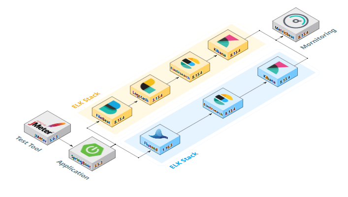
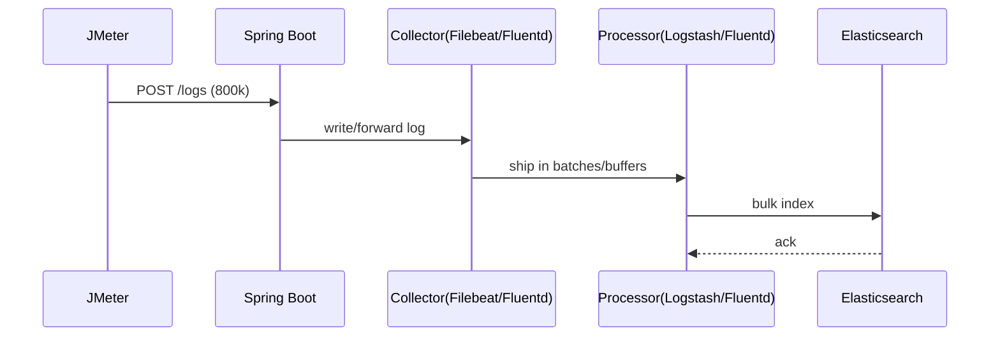

# 대용량 로그 수집/분석 ELK vs EFK 파이프라인 프로젝트


> **Elasticsearch의 동작 원리**와 **ELK·EFK의 핵심 차이**를 비교·분석하고, <br>
**로그 파이프라인을 직접 구축**하여 활용 방안을 탐구했습니다.<br>
또한 **CPU·메모리·디스크 사용량을 측정**해 두 스택의 **성능 차이**를 수치로 확인했습니다.

<br/>

## 주제 선정 이유

**많은 기업들**이 **ELK 스택을 사용**하며, **EFK도 함께 언급**됩니다. <br>
ELK와 EFK는 모두 로그 분석에 사용되지만, 수집 도구의 차이로 특징과 장단점이 다릅니다.<br>
이에 **두 스택을 직접 구현·비교**하여, **환경별 최적 선택 기준**과 **효율적인 활용 방안**을 도출하고자 했습니다.

- [DB-Engines Ranking of Search Engines 1위 Elasticsearch](https://db-engines.com/en/ranking/search+engine)
- [여기어때 기술블로그 - EKS 환경에서의 EFK 도입기](https://techblog.gccompany.co.kr/eks-%ED%99%98%EA%B2%BD%EC%97%90%EC%84%9C%EC%9D%98-efk-%EB%8F%84%EC%9E%85%EA%B8%B0-e8a92695e991)
- [Kibana 사용 기업 목록](https://www.codenary.co.kr/techstack/detail/kibana)

<br/>

## 목표

기업 환경에서 표준적으로 활용되는 ELK와, Kubernetes 친화적인 EFK를 동일 조건에서 구축·측정해 수집기(Fluentd/Logstash) 특성, 자원 사용량, 운영 복잡도 관점에서 **환경별 최적 선택 기준과 효율적 운영 방안**을 도출하는 것입니다.

<br/>

## 팀 역할 분담


<table>
  <tr>
    <!-- 이름 (링크) -->
    <td align="center">
      <a href="https://github.com/imewuzin"><strong>임유진</strong></a>
    </td>
    <td align="center">
      <a href="https://github.com/dlacowns21"><strong>임채준</strong></a>
    </td>
    <td align="center">
      <a href="https://github.com/Minkyoungg0"><strong>문민경</strong></a>
    </td>
    <td align="center">
      <a href="https://github.com/Gill010147"><strong>황병길</strong></a>
    </td>
  </tr>
  <tr>
    <!-- 프로필 사진 -->
    <td align="center">
      
    </td>
    <td align="center">
      
    </td>
    <td align="center">
      
    </td>
    <td align="center">
      
    </td>
  </tr>
  <tr>
    <!-- 역할 -->
    <td align="center">
      PPT, Elasticsearch 자료 정리
    </td>
    <td align="center">
      EFK 실험 환경 구성 및 로그 분석
    </td>
    <td align="center">
      ELK 실험 환경 구성 및 성능 측정
    </td>
    <td align="center">
      파이프라인 성능비교, 결과 정리
    </td>
  </tr>
</table>

<br/>

## 기술 스택




<br/>

## 실험 시나리오

①  **부하 생성**  
- 도구 : `JMeter 5.6.3`  
- 설정 : `threads=100`, `ramp-up=60s`, `loop=8000` → **총 800,000 req**

② **애플리케이션 수집 엔드포인트**  
- `Spring Boot 3.5.3` 가 `POST /logs` 로 **JSON 로그** 수신

③ **두 파이프라인으로 전달**  
- **ELK** : `Filebeat → Logstash(filter/grok,batch) → Elasticsearch(logs-elk-*)`  
- **EFK** : `Fluentd(in_http→buffer→out_es) → Elasticsearch(logs-efk-*)`

④ **리소스 모니터링**  
- `Metricbeat 8.13.4` 가 각 파이프라인의 **CPU/Memory/Disk** 수집

⑤ **시각화**  
- `Kibana 8.13.4` 대시보드로 **성능 측정 데이터** 시각화


<br/>

## 성능 측정 핵심 지표
- CPU 사용량
- Memory 사용량
- Disk 사용량


<br/>

## 성능 테스트 결과 요약

성능 측정 실험은 Metricbeat를 사용하여 각 파이프라인에 총 80만건의 로그데이터를 수집하는 과정을 3번 거쳐서 성능 데이터 수집 및 분석


### 1) CPU 사용량

| **ELK Stack**                                                                                          | **EFK Stack**                                                                               |
| ------------------------------------------------------------------------------------------------------ | ------------------------------------------------------------------------------------------- |
|             |  |
| <ul><li>수집 시작 시 \*\*\~80%\*\*까지 급격히 상승</li><li>처리 구간 동안 **높은 사용률 유지**</li><li>처리 완료 후 **급감**</li></ul> | <ul><li>피크 \*\*\~48%\*\*로 상대적으로 낮음</li><li>**지속시간 짧음**, 빠르게 안정화</li></ul>                   |

---

### 2) Memory 사용량

| **ELK Stack**                                                                                  | **EFK Stack**                                                                                  |
| ---------------------------------------------------------------------------------------------- | ---------------------------------------------------------------------------------------------- |
|  |  |
| <ul><li>**7.2GB / 8GB (약 94%)** 사용</li><li>처리 구간 전반에 **높은 점유율**</li></ul>                      | <ul><li>**6.0GB / 8GB (약 80%)** 사용</li><li>상대적으로 **안정적 메모리 소비**</li></ul>                      |

---

### 3) Disk 사용량

| **ELK Stack**                                                                                | **EFK Stack**                                                                                |
| -------------------------------------------------------------------------------------------- | -------------------------------------------------------------------------------------------- |
|  |  |
| <ul><li>시작 직후 \*\*\~15%\*\*까지 빠르게 도달</li><li>실험 반복 시 **점진적 증가**</li></ul>                    | <ul><li>시작 시 **\~8%** 수준</li><li>이후 **안정적 유지**</li></ul>                                     |


<br/>

## 인사이트

1. **리소스 소비 구조 차이**
   - ELK 스택의 Logstash는 JVM 기반으로 동작하여 **CPU와 메모리를 많이 소모**하는 반면, Fluentd는 C와 Ruby 기반으로 구현되어 상대적으로 가볍게 실행
   - 실제 측정 결과에서도 ELK는 CPU 80%, 메모리 94%까지 치솟았으나, EFK는 CPU 48%, 메모리 80% 수준에서 안정적으로 동작
   - 이는 **클라우드 네이티브 환경**이나 **리소스 제약이 큰 시스템**에서는 EFK가 더 적합함을 보여줌

2. **처리 성능과 복잡성의 균형**
   - Logstash는 복잡한 데이터 파이프라인 구성, 고급 필터링, 멀티 파이프라인 등을 지원하여 **대규모·정교한 로그 처리**에 강점이 있음
   - 반면 Fluentd는 플러그인 중심으로 빠르게 확장 가능하지만, 복잡한 변환보다는 **경량화·단순성**에 초점이 맞춰져 있음
   - 즉, **처리량(throughput)·정밀 제어**가 중요하다면 ELK, **경량성과 유연성**이 중요하다면 EFK를 선택하는 것이 합리적

3. **운영 안정성과 유지보수성**
   - Filebeat는 경량·단일 목적의 수집기로 안정성이 높고, 설정이 단순하여 운영 부담이 적음
   - Fluentd는 플러그인 생태계가 풍부해 다양한 데이터 소스와 연동 가능하지만, 버전 충돌·의존성 관리 문제(예: Elasticsearch 플러그인 호환성 이슈)로 **운영 시 디버깅 비용**이 발생할 수 있음
   - 따라서 **운영의 단순성 vs 확장성**이라는 선택지가 존재

4. **데이터 손실 가능성**
   - 실험 과정에서 JMeter로 80만 건을 전송했음에도 Elasticsearch에 약 68.5%만 적재되는 현상이 발생
   - 이는 Filebeat/Fluentd 버퍼링, Logstash 파이프라인 지연, Elasticsearch 인덱싱 처리 속도 등 **복합적인 병목** 때문으로 추정
   - 따라서 대용량 로그 수집 환경에서는 **버퍼 튜닝, 파이프라인 최적화, 모니터링 강화**가 필수적

5. **실무적 선택 기준**
   - **대규모 트래픽 처리, 복잡한 데이터 전처리·분석**이 필요한 경우 → **ELK 우위**  
   - **리소스 효율성, 클라우드 네이티브 아키텍처, 단순 로그 수집·전송** 중심인 경우 → **EFK 우위**  
   - 궁극적으로는 두 스택을 배타적으로 고르는 것이 아니라, **Filebeat + Fluentd 조합** 혹은 **경량 로그는 EFK, 고급 분석은 ELK**처럼 **하이브리드 접근**이 가장 실무적으로 유효


<br/>


## 트러블슈팅 

<details>
<summary><strong>1) Metricbeat 권한 오류</strong></summary>

> **요약**: Metricbeat 컨테이너가 설정 파일 권한 검사에 실패하여 즉시 종료. 설정 파일의 소유자/퍼미션을 수정해 해결.

**증상**
```bash
ERROR: Config file must be owned by the user identifier (uid=0) or root
```

**원인**
- `metricbeat.yml`의 소유자가 root(uid=0)가 아님
- Elastic Beats는 보안상 설정 파일의 소유자/권한을 엄격히 검사

**환경**
- Ubuntu + Docker Compose

**진단**
```bash
ls -la metricbeat/metricbeat.yml
# -rw-r--r-- 1 ubuntu ubuntu 2048 Aug 15 16:30 metricbeat.yml
```

**해결**
```bash
sudo chown root:root ./metricbeat/metricbeat.yml
sudo chmod 0644 ./metricbeat/metricbeat.yml
sudo docker-compose restart metricbeat
```

**검증**
```bash
sudo docker logs -f efk-stack-metricbeat-1
# 정상 기동 및 수집 로그 확인
```

**메모**
- 마운트된 호스트 파일 권한이 컨테이너 내부보다 우선 적용됨
- 임시로 `user: root` 실행 가능하나 보안상 권장되지 않음(소유자 교정 권장)

</details>

<details>
<summary><strong>2) Fluentd Elasticsearch 플러그인 버전 충돌</strong></summary>

> **요약**: Fluentd가 ES 플러그인을 로드하지 못함. 호환되지 않는 ruby gem 버전을 제거하고 호환 버전으로 고정 설치하여 해결.

**증상**
```bash
Unknown output plugin 'elasticsearch'. Run 'gem search -rd fluent-plugin' to find plugins
```

**원인**
- `elasticsearch` / `elasticsearch-api` / `elasticsearch-transport` gem 버전이 `fluent-plugin-elasticsearch`와 호환되지 않음

**진단**
```bash
sudo docker exec -u root -it efk-stack-fluentd-1 sh
fluent-gem list | grep elastic
# elasticsearch (9.1.0) ← 문제 버전 확인
```

**해결**
```bash
# 충돌 버전 제거
gem uninstall elasticsearch -v '9.1.0' -aIx
gem uninstall elasticsearch-api -v '9.1.0' -aIx
gem uninstall elasticsearch-transport -v '9.1.0' -aIx

# 호환 버전 설치(예시)
gem install elasticsearch -v '7.1.0' --no-document
gem install elasticsearch-api -v '7.1.0' --no-document
gem install elasticsearch-transport -v '7.1.0' --no-document
gem install fluent-plugin-elasticsearch -v '6.0.0' --no-document

exit
sudo docker restart efk-stack-fluentd-1
```

**검증**
```bash
curl -X GET "http://localhost:9200/fluentd-*/_count?pretty"
# 색인 정상 여부 확인
```

**메모**
- Dockerfile/이미지 빌드 시 gem 버전 고정으로 재현 방지
- 가능하면 공식 Fluentd 이미지 + 검증된 플러그인 버전을 사용하여 운영 복잡도 축소

</details>

<details>
<summary><strong>3) 데이터 수집량 차이 분석</strong></summary>

> **요약**: JMeter 80만 건 전송 대비 ES 저장 건수가 약 68.5%만 기록됨. 단계별 카운터를 수집해 손실 지점을 특정하고 버퍼·배치·인덱싱 파라미터를 조정.

**관찰**
- 계획: 800,000건 저장
- 실제: 548,427건 저장 (약 68.5%)

**흐름**


**분석 포인트**
1. JMeter 송신 성공 수 ↔ App 수신/처리 수 비교
2. Collector 큐/버퍼 잔량 및 Dropped 이벤트 확인
3. Processor 배치/지연/재시도 설정 확인
4. Elasticsearch bulk 응답 실패 항목(`errors=true`) 비율 및 유형 파악

**개선 가이드(예시)**
- Logstash
```yaml
# logstash.yml
pipeline.batch.size: 1000
pipeline.batch.delay: 50
# pipeline.workers: 2-4
# queue.type: persisted
```

- Filebeat (ES로 직접 출력 시)
```yaml
output.elasticsearch:
  bulk_max_size: 2048
  worker: 2
  compression_level: 3
```

- Fluentd
```conf
<match **>
  @type elasticsearch
  host es
  port 9200
  include_tag_key true
  <buffer>
    @type file
    path /fluentd/buffer/es
    flush_interval 1s
    chunk_limit_size 8m
    queue_limit_length 256
    retry_forever true
  </buffer>
</match>
```

- Elasticsearch 인덱싱 윈도우(대량 적재 중 한시적 완화, 완료 후 원복 권장)
```bash
PUT logs-bulk/_settings
{
  "index": {
    "refresh_interval": "30s",
    "number_of_replicas": 0
  }
}
```

**검증**
- 단계별 카운터(수신/전달/성공/실패)를 로그·메트릭으로 남겨 손실 지점 수치화
- 튜닝 전후 메트릭 비교로 개선 효과 확인

**메모**
- 튜닝값은 환경·자원·네트워크에 따라 다름. 작은 배치에서 시작해 점진적으로 올리는 방식이 안전
</details>


---

## 📎 참고 자료

- [Elastic 가이드북](https://esbook.kimjmin.net/)
- [Fluentd 공식 문서](https://docs.fluentd.org/)
- [Filebeat 공식 문서](https://www.elastic.co/beats/filebeat)


